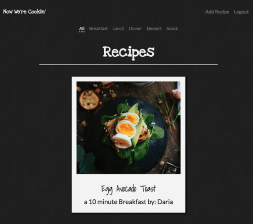
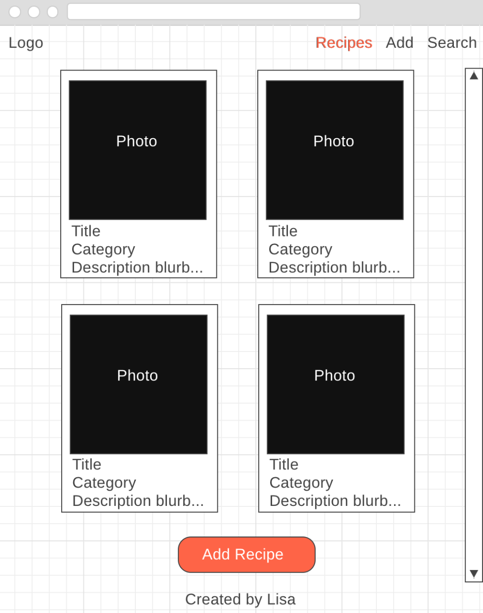
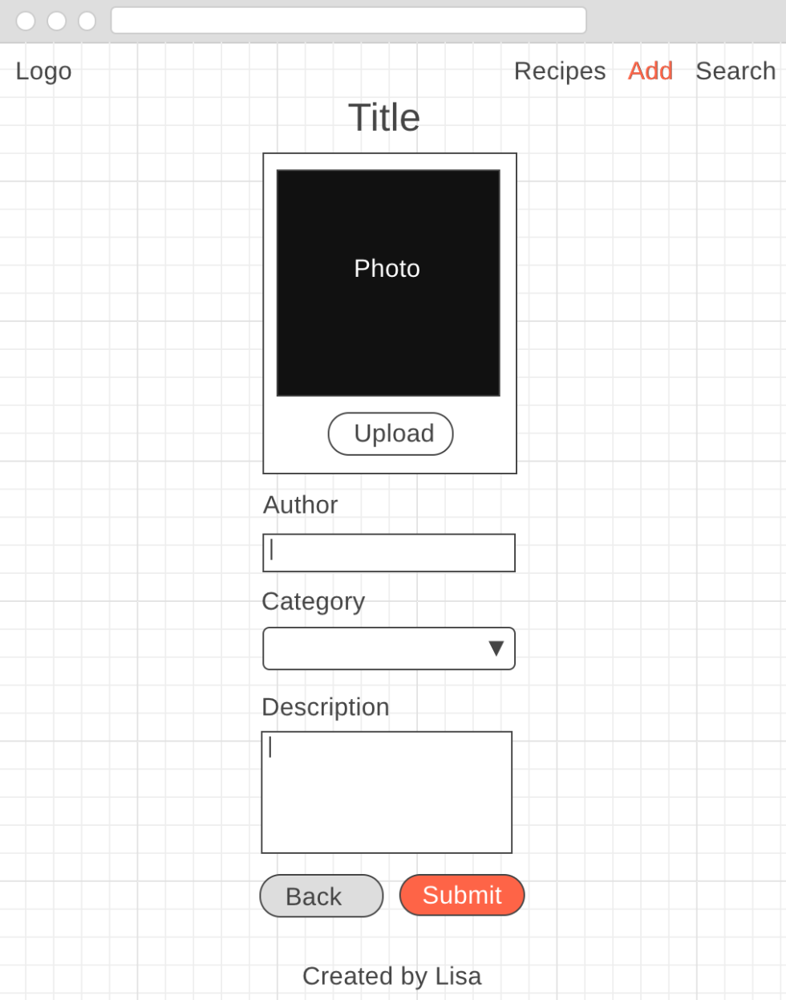
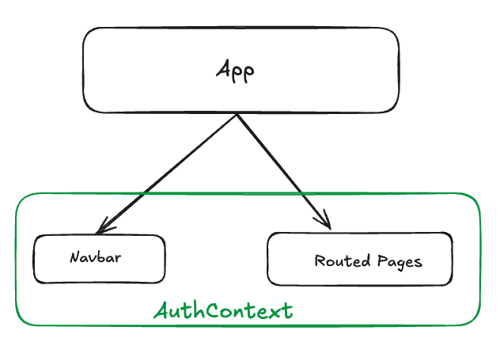

# Now We're Cookin' (V2)

## User Story

A user wants to have a place where they can create, view, edit, and delete recipes.

### Acceptance Criteria:

Users should be able to:

- Log into the application
- Access the database to view all its current recipes
- Add their own recipes to the database (including title, ingredients, instructions, photo, and category)
- Edit their own recipes in the database
- Delete their recipes from the database
- Filter recipes by associated category

## Wireframes

#### Recipes list page

#### Single/Edit Recipe view

#### Component Structure

## Technologies Used

- React: the app uses embedded javascript to render information on the page
- [React-Router](https://reactrouter.com/home): to couple URL segments to UI elements
- Node & Express: the app has its own server, built using Express
- MVC Pattern: the app uses the Model View Controller (MVC) programming design pattern
- MongoDB: the app persists data via a non-relational database for ease of application development and timing.
- Mongoose: to model and query data in MongoDB through Node
- CSS3/Flexbox: The app is efficiently well-designed and considers user experience and usability
- JavaScript: the app has front-end interactivity
- [Axios](https://axios-http.com/docs/intro): the app uses isomorphic-fetch to make XMLHttpRequests from the browser and to make http requests from node.js (back-end)
- JSON Web Token: is used to create an authentication strategy for the app
- Bcrypt: the app uses bcrypt to encrypt user passwords
- Postman: to test server requests
- Vite: for a fast modern development environment

## Approach taken

1. Drew out schema for user and recipe databases
2. Constructed wireframes to gain an understanding of the flow of the app.
3. Set up the github repo and project board with a list of steps to completion.
4. Create server and
5. Created model, controller, and route architecture
6. Test requests in PostMan
7. Created React components
8. Styled components

## Major Technical Challenge

[CreateContext()](https://react.dev/reference/react/createContext). Context provides a way to share data across multiple components in a component tree without having to manually pass props down through every level (known as "prop drilling"). It is suitable for global or application-wide data, such as user authentication status, theme settings, or language preferences.

Context is created using `createContext()` and consumed using `useContext()`.

The AuthContext provider for NWC (paired with axios) handles user authentication requests and sets user authorization tokens.
This is how the application

- logs in/out users
- conditionally renders edit/delete buttons
- allows users to only edit/delete their own recipes

## Installation Instructions

1. Run `npm install` to install all necessary dependencies listed in the package.json
2. In psql run `create database recipe_development`
3. Create a `.env` file in the root. You'll need to have a `MONGO_URI` to connect to your MongoDB and a `JWT_SECRET` to create and validate user tokens (authentication).
4. To launch the app locally run `npm run dev` from the root folder and navigate to **localhost:5173** in your browser.

## Unsolved Problems

- The 'All' recipes page takes a while to load, this could be due to the conditional db query logic (to check for category).
- I would like to create a separate category container component rather than always have it in the `Home` component
- If a category has no recipes, [after a while] that category page will just load all recipes, since an empty query for Mongoose's `.find()` method will return all documents.
- Error handling for failed login/signup attemps
- I tried to wrap each ingredient input with a label for accessibility, but it threw an error
- This setup does not account for if a recipe can be included in multiple categories

## Next Steps

- update styling to use SCSS
- add styling for dark/light mode
- back to top button
- allow users to upload a photo or video link
- allow users to faovrite recipes
- handle measurement of ingredients
- dynamic cook time into hours _and_ minutes

## Resources

- [CreateContext()](https://react.dev/reference/react/createContext)
- [Mongoose Atomic Updates](https://mongoosejs.com/docs/tutorials/findoneandupdate.html)
- [React-Router Routing](https://reactrouter.com/start/declarative/routing)
- [React-Router Navigation](https://reactrouter.com/start/declarative/navigating)
